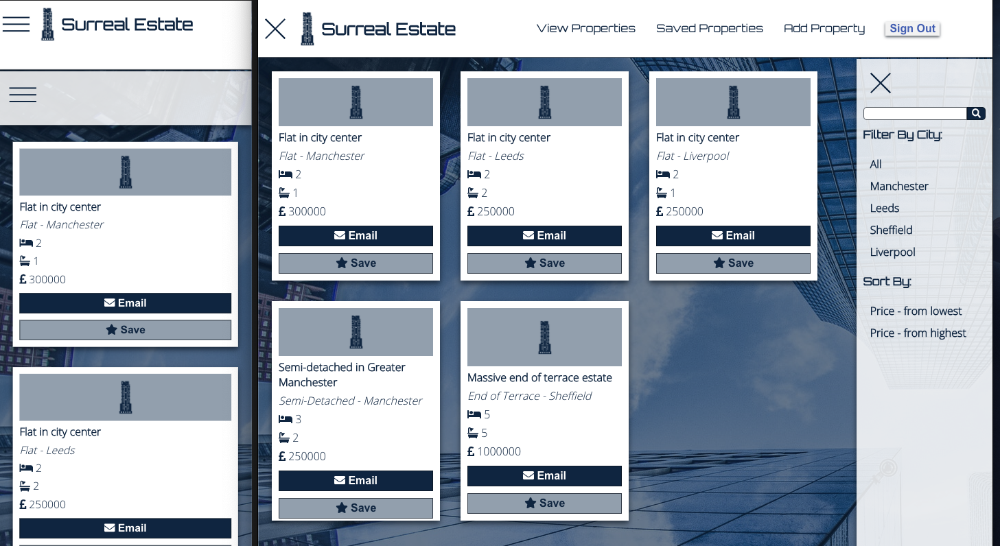

This is a ficticious real-esate site/app

## The brief

create a property search engine that will have multiple pages:

- A listings page where you can search for different properties and sort/filter the results.

- An add property page where you will add new properties.

- A property page.

Properties come from an API created by Manchester Codes, but has been self-deployed to a Heroku server for live use.

## Concepts to be utilized

- Single Page Application (SPA)

- Client-side Routing

- Controlled Inputs

- HTTP Requests

- API Interaction

- OAuth

## Technologies Used

- React using Create-React-App
- Heroku / MongoDB
- Netlify
- Jest
- React Testing Library

## Dependencies 

- Axios
- qs 
- react-facebook-login
- font-awesome

--------

This project was bootstrapped with [Create React App](https://github.com/facebook/create-react-app).

## Available Scripts

In the project directory, you can run:

### `npm start`

Runs the app in the development mode. 
Open [http://localhost:3000](http://localhost:3000) to view it in the browser.

The page will reload if you make edits. 
You will also see any lint errors in the console.

### `npm test`

Launches the test runner in the interactive watch mode. 
See the section about [running tests](https://facebook.github.io/create-react-app/docs/running-tests) for more information.

## Author

Justin Sandahl
